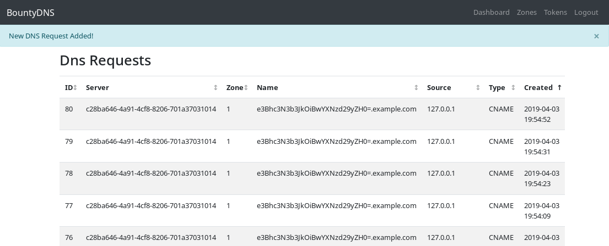

# Bounty DNS: A DNS Catcher

Status: WIP / PoC



This project is an attempt to implement a lightweight burp collaborator-esc application and consists of two main components: a DNS Server (Custom Python Implemention with dnslib) and an API.

When answering queries, the DNS server hits the API with information regarding the DNS query. The API will then serve the log of the DNS queries via a RESTful HTTP API as well as front-end (HTML/JS) web GUI.

## Phase 1: Build the PoC (Current)

The first iteration of the project will be a proof of concept to demonstrate the project's viability. At this point, the project should not be considered stable, secure, or feature complete.

Features:
- Create API Tokens via WebUI / CLI for Dns Servers
- Create Zones for Specific DNS Servers
- Log DNS Resolution

## Phase 2: Polish The Code

After demonstrating that the project is worth dedicating time to, Phase 2 will involve making the project feature complete with all clients (JS / SimpleWeb / CLI) and features (webhooks / email / queue) completed. At this point, the project should not be considered stable nor secure.

## Phase 3: Stability

Next, sanity checks and proper handlers will be put in place so that API calls fail gracefully. At this point the project should not be considered secure.

## Phase 4: Release 0.1.0-alpha

Once I'm satisfied the code is not complete trash, I'll release it as version 0.1.0-alpha. At this point, the project should be considered secure enough to deploy. Though I'd recommend doing so in a protected network. If the application proves valuable enough to me personally or others, I'll continue to add features / improvements.

TODO:

- [x] Build DNS Implementation
- [x] Build CLI Foundation
- [x] Build Alembic Commands
- [x] Build API Auth Routes
- [x] Build API Authentication Controls
- [x] Build API Token Capabilities (Generate Extended Auth Tokens)
- [x] Build API Zone / DNS Routes
- [x] Integrate API Callbacks into DNS Server
- [x] Build Web GUI Foundation
- [x] Incorporate ApiClient and ApiTokens into DNS Server
- [ ] Get Websockets Working
- [ ] Build ability for webhook's / events
- [ ] Handle Pagination on the Front End
- [ ] Perform Validation on the Front End
- [ ] Perform Better Validation on the Backend
- [ ] Handle Errors on the Front End
- [ ] Confirm DNS Server is as Compliant as possible
```
usage: bdnsctl.py [-h]
                  {test,tests,alembic-current,alembic-downgrade,alembic-history,alembic-init,alembic-migrate,alembic-show,alembic-stamp,alembic-upgrade,zone-create,zone,zone-list,zones,api-server,api,api-urls,urls,api-zone-list,api-zones,dns-server,dns}
                  ...

positional arguments:
  {test,tests,alembic-current,alembic-downgrade,alembic-history,alembic-init,alembic-migrate,alembic-show,alembic-stamp,alembic-upgrade,zone-create,zone,zone-list,zones,api-server,api,api-urls,urls,api-zone-list,api-zones,dns-server,dns}
                        command
    test (tests)        run tests
    alembic-current     run alembic current
    alembic-downgrade   run alembic downgrade
    alembic-history     run alembic history
    alembic-init        run alembic init
    alembic-migrate     run alembic migrate
    alembic-show        run alembic show
    alembic-stamp       run alembic stamp
    alembic-upgrade     run alembic upgrade
    zone-create (zone)  create zones
    zone-list (zones)   list zones
    api-server (api)    run api server
    api-urls (urls)     list api urls
    api-zone-list (api-zones)
                        list zones via API
    dns-server (dns)    run dns server

optional arguments:
  -h, --help            show this help message and exit
```
